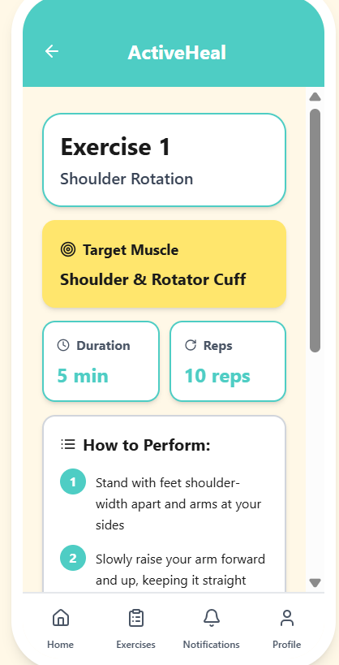
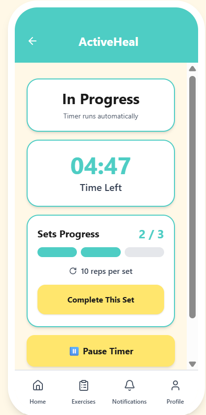
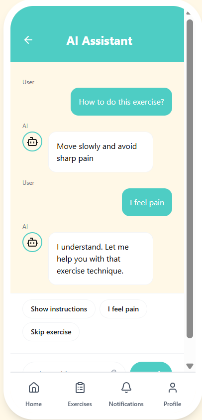

# ActiveHeal

A mobile rehabilitation support system designed to improve patient adherence, progress tracking, and communication with physiotherapists.

## About the Project

ActiveHeal is an HCI project focused on designing a user-centered mobile rehabilitation experience. The system supports patients throughout their rehabilitation journey through exercise guidance, progress monitoring, reminders, therapist communication, and AI-assisted support.

## Interface Preview

  
  
  

## Key Features

- Exercise tracking
- Video-guided exercises
- Progress monitoring
- Rehabilitation reminders
- Therapist communication
- AI-assisted support
- Daily check-ins

## Design Process

The project followed a Human-Centered Design approach:

1. Requirement identification
2. Low-fidelity sketches and wireframes
3. High-fidelity prototyping in Figma
4. Heuristic evaluation
5. Usability testing
6. Interface refinement

## Tools

- Figma
- Human-Centered Design
- Usability Testing
- Heuristic Evaluation

## Interactive Prototype

[View ActiveHeal Prototype](https://frame-prize-68881232.figma.site)

## Project Poster

[View Project Poster](ActiveHeal-Poster.pdf)

## Project Type

HCI Team Project
